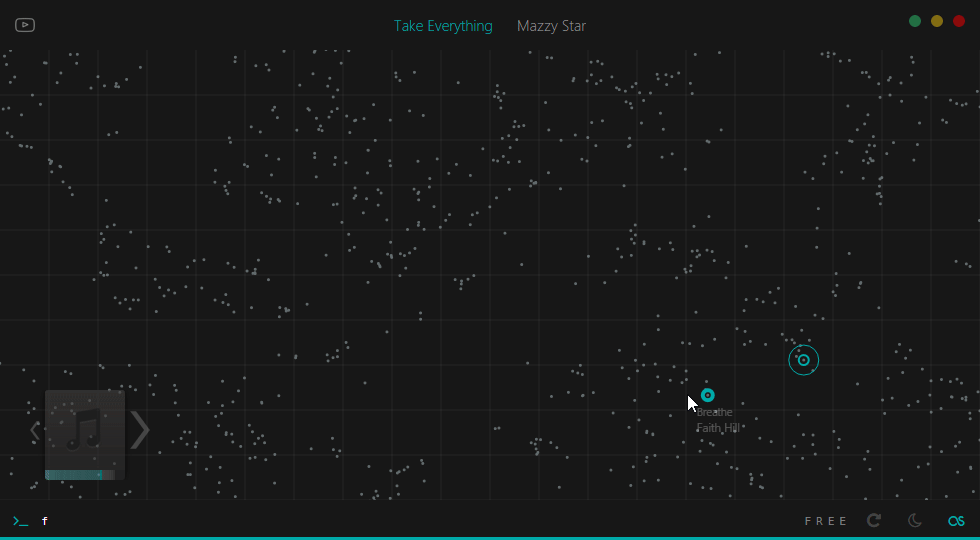

# blackbird

<kbd>under development</kbd>

Exploratory music player



---

#### Setup

```shell
# Install deps
cd ./src
npm install
pip install numpy pyprind eyed3

# Compile sass
sass --update ./app/styles

# Use `./utils/scan.py` to scan music
# and arrange items randomly in the space
# Generating proper coordinates (as seen in above screen recording)
# is under development

cd ./utils
python scan.py <musicdir>

# Setup credentials in `./app/js/config.js`
```

#### Usage

`npm start`

##### General

- Bottom row contains command entry and general indicators for mode, repeat and sleep.


- Header contains playback controls (hover over coverart), visualizer, seekbar and error indicator.


- Use right click for draggin the space.


##### Commands

- `a` / `artist` → *Artist mode*. View songs by current [song] artist
- `am` / `album` → *Album mode*. View songs from current [song] album
- `s <term>` / `search <term>` → *Search mode*. View items with term in name/artist/album
- `f` / `free` → *Free mode*. View all items
- `sim` / `similar` → Sort in-mode according to similarity with current song
- `r` / `repeat` → Toggle repeat
- `slp <n>` / `sleep <n>` → Sleep after playing `n` songs
- `l` / `love` → Mark songs as loved in last.fm

##### Shortcuts

- <kbd>ctrl+alt+\<right\></kbd> → Next song
- <kbd>ctrl+alt+\<left\></kbd> → Previous song
- <kbd>ctrl+alt+\<space\></kbd> → Play/pause
- <kbd>ctrl+alt+\<down\></kbd> → Hide to tray
- <kbd>ctrl+alt+\<up\></kbd> → Pop to front
- <kbd>alt+x</kbd> → Enter command (while window active)

#### Todos

- Script to learn songs vectors containing knowledge from `lastfm` history. Few of the thigns i am trying out are
  - Convnets on spectograms (or mel spectogram).
  - Some sort of sequence autoencoder on mel coefficients.
  - Use listen sessions (listens in one go) to get joint preference information for songs and learn a siamese LSTM network (waiting for a good GPU) to learn similarity.
- Bring media scanning to frontend.
- Sequencing commands to plan out (really) long sessions.
